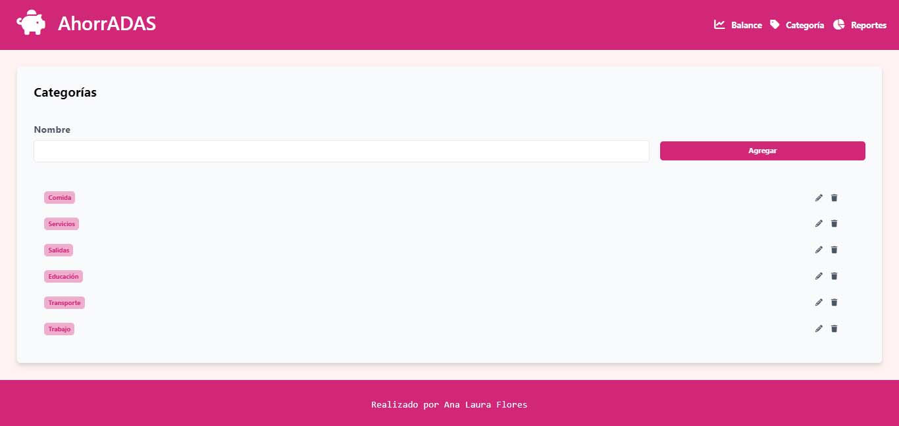

# Proyecto AhorrADAS - Proyecto JS para Carrera Desarrollo Frontend ADA
<p> Es una aplicación de control de gastos y ganancias realizada con lenguaje (JavaScript). Desarrollado el HTML con tailwind. </p>
<p> Corresponde al módulo III de la carrera de Desarrollo Frontend ADA - por lo cual es parte de un proceso de aprendizaje </p>

[link del proyecto](https://ana-laura-flores.github.io/ahorradas-proyect-javascript/)


 - Se utiliza lenguaje HTML, utilizando tailwindcss y se utiliza JavaScript para lograr las funcionalidades de todo el proyecto.

<!-- ``` html
    <footer class="bg-[#D22779] w-full h-24 flex justify-center items-center">
        <h2 class="text-white text-lg font-mono	">Realizado por Ana Laura Flores</h2>
    </footer>

 ```      -->
 <!-- fragmento de código HTML       -->


 - En el desarrollo del proyecto para su funcionamiento se utiliza JavaScript. Utilizando metodos, eventos, funciones.

 - Los datos se almacenan en el localStorage, mantiendo actualizada la info y los datos a cada momento.

 <!-- ``` javascript
 const deleteOperation = (id) => {
  const currentOperation = getData("operations").filter(
    (operation) => operation.id !== id);
  setData("operations", currentOperation);
};
``` -->
<!-- ejemplo de una función realizada en el proyecto (esta función permite que eliminar una operación guardada) -->
 
 <br>


## Es una aplicación para control de gastos y ganancias.
<br>
<p>Podrás agregar operaciones, generar balances, filtrar los datos, agregar y quitar categorías, editarlas.<em> Ideal para llevar tus numeros.</em></p>
<br>


<br>
<br>


<br>

<p>Podés analizar como gastás y en que podés ahorrar. <em>Concientización de gastos.</em></p>
<br>


<br>

### A medida que vas cargando las operaciones los resultados aparecerán. Msotrandote asi los resumenes en los reportes para que puedas evaluar en que gastás y en que podrías ahorrar y como reforzar tus ganancias.
<br>

### Todos los datos que vas ingresando se van almacenando de manera interna en tu navegador.


<br>

### No compatible con firefox ( se utiliza la funcion toSorted la cual no es soportada por firefox segun la documentación disponible)
<br>


<br>
<p style="font-family:Arial; font-size:24px;"> Ana Laura Flores </p>
 <p style="font-family:Arial; font-size:12px; color:#d813be"> (DISEÑADORA GRÁFICA UBA - ESTUDIANTE FRONTEND) </p>


